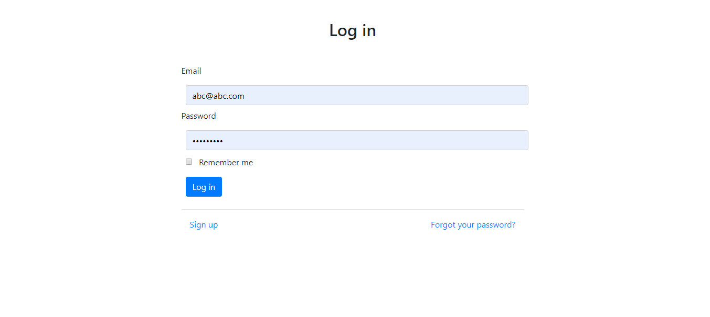
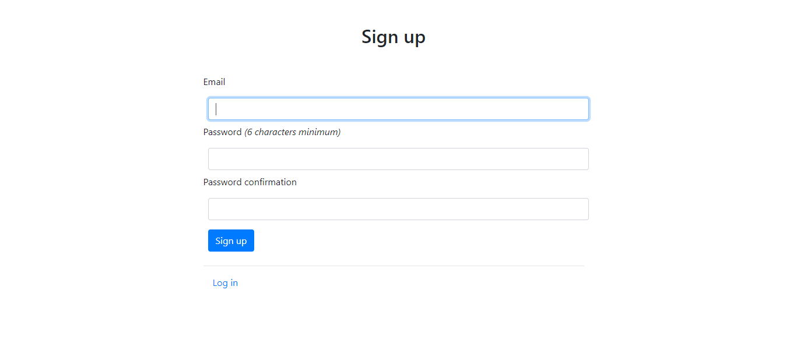
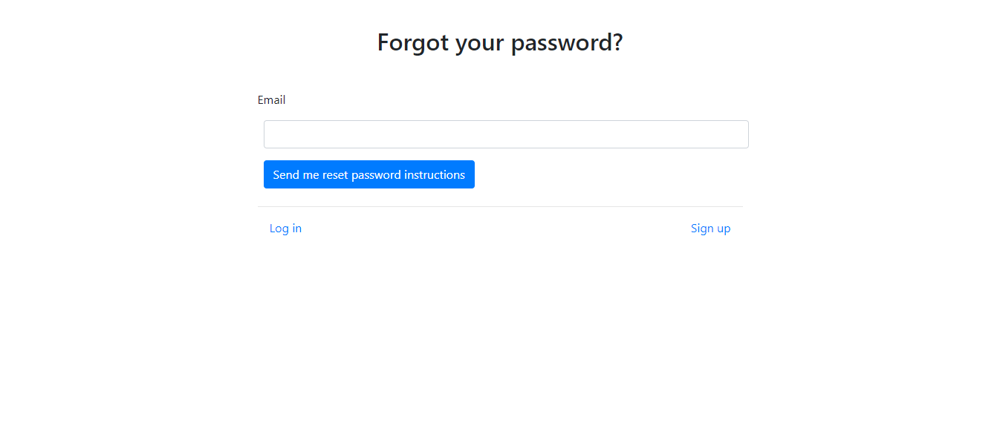

# Rails 6 devise example
It is an example app and a basic template for devise auth in rails 6 with omni github auth.

## Build with
- Rails on rails
- Bootstrap with webpack
- Github OAuth

## Get Started
### Requirement
- Ruby 2.6
- Rails 6
- Foreman gem

### Clone
```bash
git clone https://github.com/imhta/rails_6_devise_example.git
cd rails_6_devise_example
```
### Install and migrate db

```bash
bundle install 
rails db:migrate
```
### Start Server
To start rails server
```bash
rails serve

```
To start webpack server because rails 6 in default use webpack
```bash
foreman start -f Procfile.dev
```


## Screenshots

### Log In Page


### Sign Up Page


### Forgot password Page

